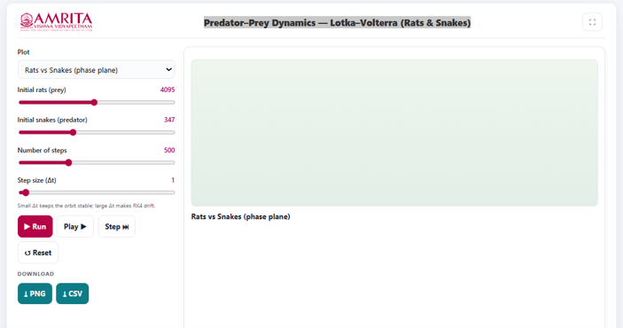
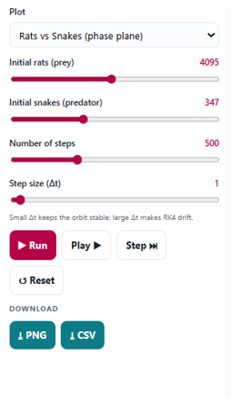
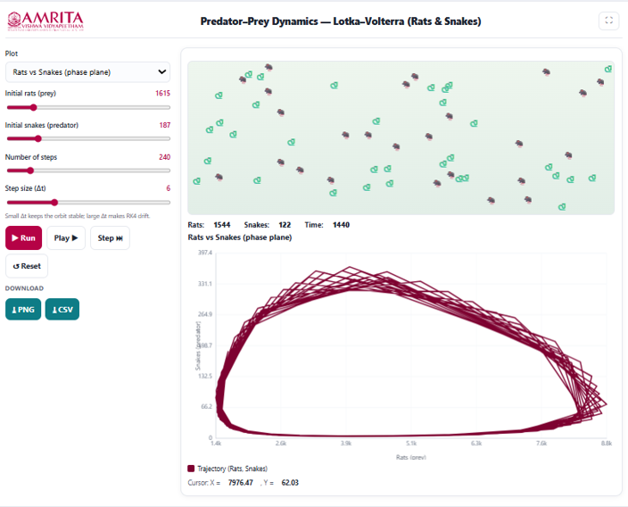

### Procedure

1. The simulator enables users to investigate the population dynamics of interacting predator and prey species using the Lotka–Volterra model. Users can configure the initial populations, simulation duration, and numerical integration parameters, execute the simulation, and visualize the temporal and phase-plane relationships between rat (prey) and snake (predator) populations.

 
&nbsp;

2. The simulator consists of a parameter panel on the left and a visualization panel on the right for displaying the selected graphical output.

 
&nbsp;

3. Select the desired graph from the Plot drop-down menu. The simulator provides different graphical representations of the predator–prey system, including the Rats vs Snakes (phase plane) and other available plots for analyzing population dynamics.
 
&nbsp;

4. Specify the initial rat population (prey) using the Initial rats (prey) slider. This parameter defines the number of prey individuals present at the beginning of the simulation.
 
&nbsp;

5. Specify the initial snake population (predator) using the Initial snakes (predator) slider. This parameter defines the number of predator individuals initially present in the ecosystem.
 
&nbsp;

6. Set the total number of simulation steps using the Number of steps slider. This parameter determines the total number of computational iterations used to simulate predator–prey interactions.
 
&nbsp;

7. Adjust the simulation step size (Δt) using the Step size (Δt) slider. The step size determines the time increment used in the numerical solution of the Lotka–Volterra equations. Smaller values of Δt generally improve numerical stability and accuracy, whereas larger values may introduce numerical errors in the simulated trajectories.
 
&nbsp;

8. After configuring all simulation parameters, click the Run button to execute the simulation and generate the selected graphical output.

 
&nbsp;

9. Observe the animation panel displayed above the graph. The animation provides a visual representation of the rat (prey) and snake (predator) populations as they interact throughout the simulation.
 
&nbsp;

10. Examine the simulation statistics displayed below the animation panel, including the current Rat population, Snake population, and Simulation Time. These values are updated continuously as the simulation progresses.
 
&nbsp;

11. Observe the Rats vs Snakes (Phase Plane) graph displayed beneath the animation. The graph illustrates the relationship between predator and prey populations throughout the simulation rather than their variation with time.
 
&nbsp;

12. Interpret the X-axis (Rats – Prey Population) to determine the number of prey individuals and the Y-axis (Snakes – Predator Population) to examine the corresponding predator population.
 
&nbsp;

13. Follow the phase-plane trajectory to observe how the predator and prey populations change relative to one another during successive stages of the population cycle.Identify the closed-loop trajectory, which represents the characteristic cyclic behaviour predicted by the Lotka–Volterra predator–prey model. The repeating orbit indicates periodic oscillations in prey and predator populations.
 
&nbsp;

14. Compare different regions of the trajectory to understand how increases in prey abundance are followed by increases in predator abundance, and how subsequent declines in prey are followed by declines in predator populations, producing continuous population cycles.
 
&nbsp;

15. Move the cursor over the graph, if required, to display the corresponding coordinate values shown beneath the graph. These values indicate the predator and prey population sizes at a specific point on the phase trajectory.
 
&nbsp;

16. Modify one or more simulation parameters, such as the initial rat population, initial snake population, number of simulation steps, or step size (Δt), and execute the simulation again to examine how these parameters influence the shape, size, and stability of the phase-plane trajectory.
 
&nbsp;

17. If required, click the Play button to replay the simulation continuously or click the Step button to advance the simulation one computational step at a time for detailed observation of predator–prey interactions.
 
&nbsp;

18. Click the Reset button to restore the default simulation parameters before performing another simulation.
 
&nbsp;

19. Download the graphical output by clicking the PNG button or export the numerical simulation data by clicking the CSV button for further analysis and comparison.
 
&nbsp;

20. Repeat the above procedure using different initial population sizes and numerical simulation parameters to compare the resulting phase-plane trajectories and investigate how initial conditions influence predator–prey population dynamics.

