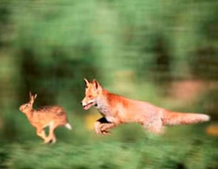
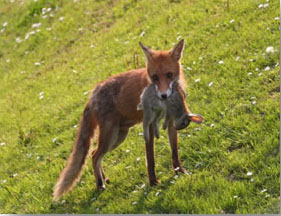
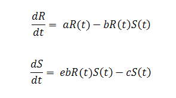

&nbsp;

Many of the most interesting dynamics in the biological world have to do with interactions between species. In ecology, predation explains a biological interaction where a predator forages on its prey. The predator-prey relationship is substantial in maintaining the equilibrium  between various animal species. Without predators, certain species of prey would force other species to extinction as a result of competition. Without prey, there would be no predators! The key feature of predation thus is the predator's direct impact on the prey population. Cheetahs and gazelles, Polar bears and seals, Foxes and Rabbits, Birds and Insects, etc are typical examples.

 
&nbsp;

We can explain the critical effects that can be caused by an imbalance in the Predator-Prey relationship. We will consider a predator-prey population where Foxes hunt Rabbits. Imagine a situation where, due to increase in Illegal Poaching, the number of Fox drastically falls down. Those that survive may fear coming out during day time and may decide to go in search of food during the night when they are at a serious disadvantage, as evolution has not favoured them to have the skills of poaching nocturnal! They won't survive in such conditions. How does this affect the Ying-Yang? Now, the population of Rabbit starts to spike at that area, thus leading to competition for existing food sources. Since most are likely to starve, they go in search of alternate food sources. They start exploring beyond their usual boundaries, they step foot into the World Dominated by Primates!! They learn quickly that, there is easy and direct access to food at our farms and agricultural fields. Gradually the numbers depending on our agriculture shoots up. Our crops get destroyed, chances of Zoonosis increases, etc. They can affect our Economy, Health and Hygiene, Food supply, etc.

&nbsp;

What if the situation is reversed? A scenario where deforestation or hunting of rabbits by man for fur, sport or meat leads to the critical reduction in their numbers. This critical reduction in Rabbit population leads to the Fox population going in search for alternate sources for food. A few might track down the Rabbits into human settlements; others generate an interest in our cattle and Poultry. Regular attacks get reported, there can even be human casualties. Domestic grazing populations also take the toll, as they are the easiest of targets. The chain can go on and on.

 
&nbsp;

Many studies on the population ecology of predators have demonstrated that predator numbers rise-and-fall cyclically with those of their preferred prey - albeit that there is a synchronicity between the populations. This scenario -- where the predator populations crash shortly after their prey populations experience a crash; this is known as predator-prey cycle. Logic and mathematical theory propose that when the prey population is abundant, their predator count will increase, consequently the prey population will decrease, which in turn accounts predator count to decline. The prey population eventually restores, starting a new cycle.

&nbsp;

In order to simulate these dynamics, Mathematical models need to be incorporated. The population dynamics of predator-prey interactions can be modelled using the Lotka−Volterra equations, which is based on differential equations. These provide a mathematical model for the cycling of predator and prey populations. The mass action approach to modelling tropic interactions was pioneered, independently, by the American biophysicist Alfred James Lotka (1925) and Italian mathematician Vito Volterra (1926). These authors argued that consumer (predator) and resource (prey) populations could be treated like particles interacting in a homogeneously mixed gas or liquid and under these conditions, the rate of encounter between consumers and resources (the reaction rate) would be proportional to the product of their masses (the "law of mass action").

The Lotka-Volterra Prey-Predator model involves two equations, one which describes how the prey population changes and the second which describes how the predator population changes. We will look at Lotka-Volterra equation using a Predator-Prey dynamic population of Snakes and Rats. The dynamics of the interaction between a rat population R and a snake population S is described by the differential equations:

 
&nbsp;

Where, 

**a** is natural growth rate of R in absence of S,

**c** is natural death rate of snakes in the absence of food R,

**b** is the death rate per encounter of R due to predation,

**e** is the efficiency of turning predated R into S.

&nbsp;

The classic, textbook predator-prey model proposed by Lotka and Volterra in 1927; in words, states that;

  

* Each prey gives rise to a constant number of offspring per year; In other words, there are no other factors limiting prey population growth apart from predation.

* Each predator eats a constant proportion of the prey population per year; In other words, doubling the prey population will double the number eaten per predator, regardless of how big the prey population is.

* Predator reproduction is directly proportional to prey consumed; another way of expressing this is that a certain number of prey consumed results in one new predator; or that one prey consumed produces some fraction of a new predator.

* A constant proportion of the predator population dies per year. In other words, the predator death rate is independent of the amount of food available.

To simplify the complexity of the Dynamic models being studied, we make some assumptions. Generally, we will make some assumptions that would be unrealistic in most of these predator-prey situations. For better understanding we will explain it using the example of the Fox-Rabbit population. Here, we assume that;

1. The predator species is totally dependent on a single prey species as its only food supply,

2. The prey species has an unlimited food supply and

3. There is no threat to the prey other than the specific predator.

&nbsp;

